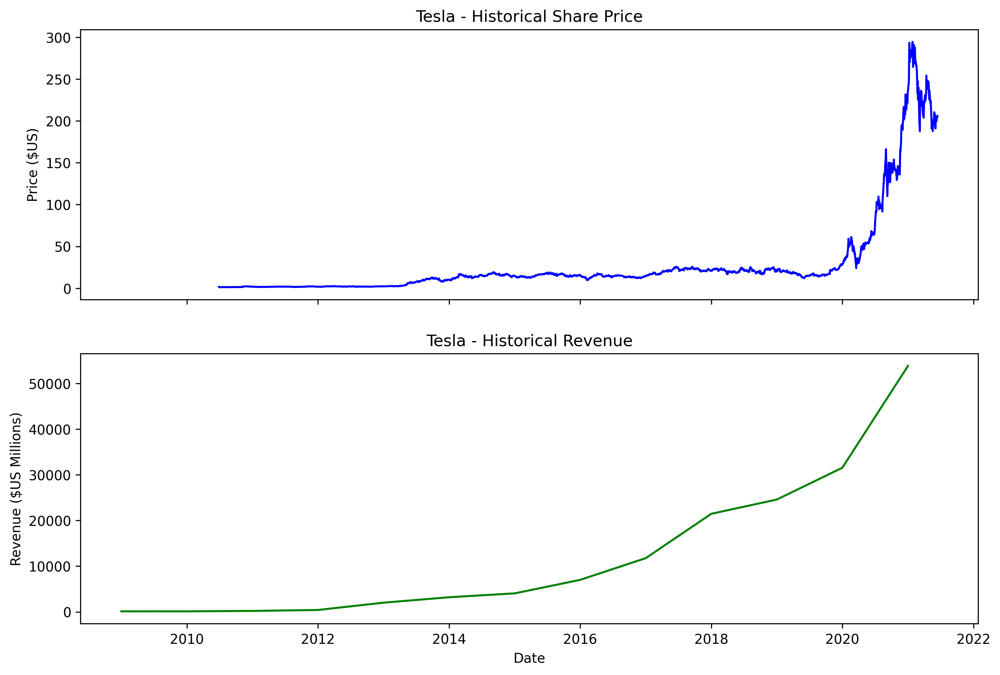
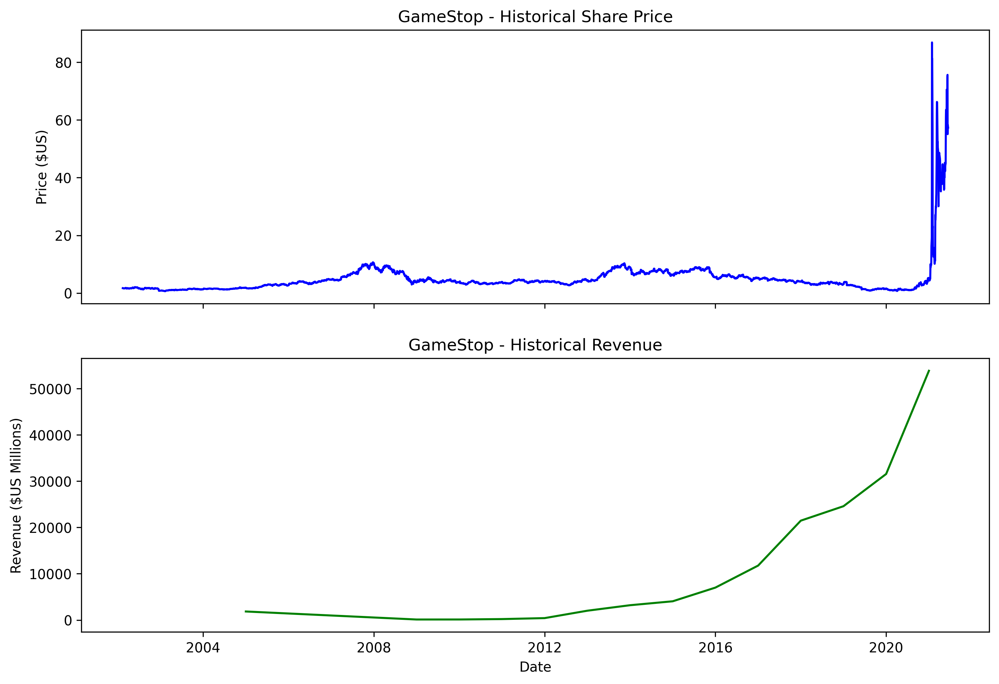

# IBM-Data-Science-dashboard-Project
IBM Data Science - Interactive Dashboard
This project is part of the IBM Data Science Professional Certificate. It focuses on analyzing historical stock data for Tesla and GameStop and visualizing the results using a dynamic dashboard.

🛠 Tools & Libraries
Python (Pandas, Plotly, Dash)

Web Scraping (BeautifulSoup)

Data Visualization

📊 Project Preview
Below are the results of the stock analysis:

